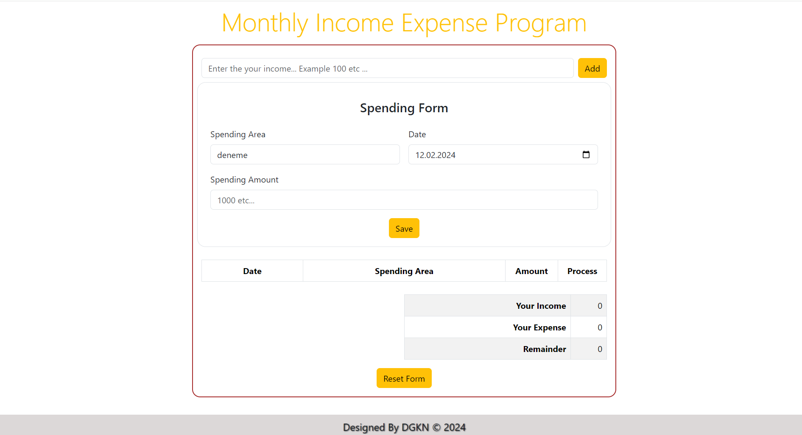

## Monthly Income Expense Project

# Description
Project aims to create Monthly Income Expense Program.

## Objective
At the end of the project, following topics are to be covered;
* HTML
* CSS
* Bootstrap
* JavaScript
* DOM Manipulations

-----

### Project Skeleton:

```
    Income_Expense_Prj (folder)
    |
    |---- app.js
    |---- index.html
    |---- project_view.png
    |---- Readme.md
    |---- style.css
```

### Project View Images:



> Designed By DOGUKAN © Feb 2024